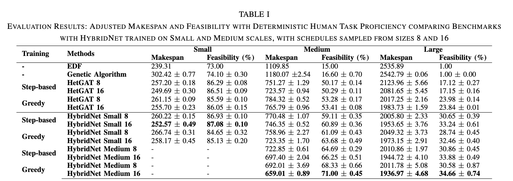
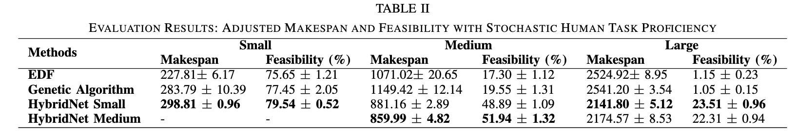
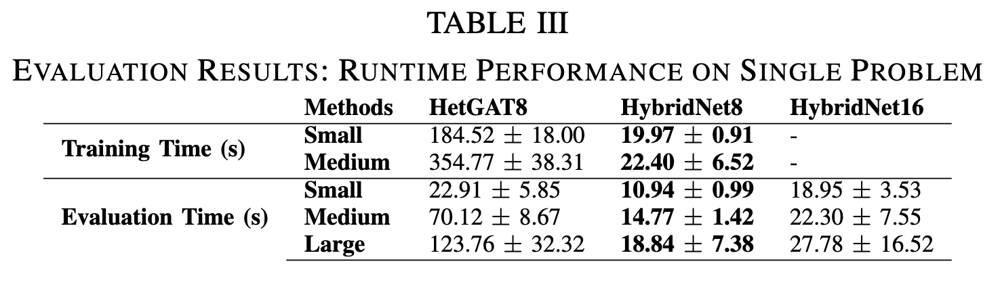

# HybridNet: Learning Coordination Policies over Heterogeneous Graphs for Human-Robot Teams via Recurrent Neural Schedule Propagation

The [Conference Paper link](https://cpb-us-w2.wpmucdn.com/sites.gatech.edu/dist/d/958/files/2022/08/IROS2022_HybridNET.pdf) for Human Robot Team Scheduling Pipeline using Graph Attention Networks for embedding generation and RNN for sequential action schedule generation for Multi-Round Scheduling

## File Structure
- ./requirements.yaml -- conda environment requirements
- ./hetnet.py -- the gnn model 
- ./testlayer.py -- sanity check on model implementation
- ./utils.py -- utility functions and Scheduling Env
            class SchedulingEnv(object) handles the scheduling actions and updates constraints
        but is a highly customized one, so we want to implement a similar one under
        openai gym structure            
- ./graph/hetgat.py -- GAT layer implementation
- ./benchmark/ -- Evaluation code for ScheduleNet and baseline heuristics
        edfutils.py has some simple class for robot teams
- ./gen/ -- Generate random problem instances
        mrc.py details how the constraints are sampled
- ./env/ -- OpenAI based Environment for Single Round and Multi-Round Scheduling
- ./evolutionary_algorithm.py -- Genetic Algorithm functions for generating schedules using multi-generational optimization

## Environment Setup
Create the environment using the `requirements.yaml` file using:

```bash
conda env create -f requirements.yaml
```

Activate environment using:
```bash
conda activate hybridnet
```

## 
## Generate Task Allocation Problems:

robot: 2
human: 2
task_min: 9
task_max: 11


```bash
# Small Training Set
python generate_problems.py --folder=data/small_training_set/problems --human=2 --robot=2 --task-min=9 --task-max=11 --start-problem=1 --end-problem=2000
# Small Test Set
python generate_problems.py --folder=data/small_test_set/problems --human=2 --robot=2 --task-min=9 --task-max=11 --start-problem=1 --end-problem=200
# Medium Training Set
python generate_problems.py --folder=data/medium_training_set/problems --human=2 --robot=2 --task-min=18 --task-max=22 --start-problem=1 --end-problem=2000
# Medium Test Set
python generate_problems.py --folder=data/medium_test_set/problems --human=2 --robot=2 --task-min=18 --task-max=22 --start-problem=1 --end-problem=200
# Large Test Set
python generate_problems.py --folder=data/large_training_set/problems --human=2 --robot=2 --task-min=36 --task-max=44 --start-problem=1 --end-problem=200
```

## Training Models

### HybridNet Model
To train the HybridNet model, use the `trainer.py` file with the matching arguments

- `--checkpoint`: folder to store the checkpoints of the training, stores every 10 epoch of training
- `--mode`: training mode, for Policy Gradient use `pg` and for Greedy Baseline Policy Gradient use `gb`
- `--folder`: the folder that contains the training problem sets
- `--start-problem`: The Smallest problem number to train with (inclusive)
- `--end-problem`: The Largest problem id number to train with (inclusive). Training iterates through each problem and resets the training problem counter to `start-problem` when completing the `end-problem`
- `--epoch`: The number of epochs to train the model
- `--weight-decay`: The Weight Decay of the Neural Network to prevent overfitting.
- `--infeasible-coefficient`: The weight of the infeasible task completion, defaults to 2.0.
- `--entropy-coefficient`: Not used in the version of the IROS2022 submission
- `--nn`: Model type to train `hybridnet` for Model using LSTM Propagator and `hetgat` for interactive sequential HetGAT Model.
- `--resume-cp`: Add to select the epoch to resume training for. Leave out to start training from scratch.
- `--human-noise`: Boolean flag. Include in run to enable Stochastic Mode
- `--estimator`: Boolean flag. Include in run to enable estimator use. If not set, uses the actual human task duration (sampled if `--human-noise` is set)
- `--estimator-noise`: Boolean flag. Include in run to enable noise within the estimator. If not set, the estimator will produce mean of task-agent duration for given instance.

#### Deterministic Model Training for HybridNet
```bash
# Small Policy Gradient
python trainer.py --checkpoint=data/small_training_set/checkpoints_hybridnet_pg --mode=pg --folder=data/small_training_set/problems --start-problem=1 --end-problem=2000 --epoch=12000 --weight-decay=5e-4 --entropy-coefficient=0.0 --infeasible-coefficient=2.0 --nn=hybridnet
# Small Greedy Baseline
python trainer.py --checkpoint=data/small_training_set/checkpoints_hybridnet_gb --mode=gb --folder=data/small_training_set/problems --start-problem=1 --end-problem=2000 --epoch=12000 --weight-decay=5e-4 --entropy-coefficient=0.0 --infeasible-coefficient=2.0 --nn=hybridnet
# Medium Policy Gradient
python trainer.py --checkpoint=data/medium_training_set/checkpoints_hybridnet_pg --mode=pg --folder=data/small_training_set/problems --start-problem=1 --end-problem=2000 --epoch=12000 --weight-decay=5e-4 --entropy-coefficient=0.0 --infeasible-coefficient=2.0 --nn=hybridnet
# Medium Greedy Baseline
python trainer.py --checkpoint=data/medium_training_set/checkpoints_hybridnet_pg --mode=gb --folder=data/small_training_set/problems --start-problem=1 --end-problem=2000 --epoch=12000 --weight-decay=5e-4 --entropy-coefficient=0.0 --infeasible-coefficient=2.0 --nn=hybridnet
```

#### Stochastic Model

```bash
# Small Policy Gradient
python trainer.py --checkpoint=data/small_training_set/checkpoints_hybridnet_stoc_pg --mode=pg --folder=data/small_training_set/problems --start-problem=1 --end-problem=2000 --epoch=12000 --weight-decay=5e-4 --entropy-coefficient=0.0 --infeasible-coefficient=2.0 --nn=hybridnet --human-noise --estimator --estimator-noise
# Small Greedy Baseline
python trainer.py --checkpoint=data/small_training_set/checkpoints_hybridnet_stoc_gb --mode=gb --folder=data/small_training_set/problems --start-problem=1 --end-problem=2000 --epoch=12000 --weight-decay=5e-4 --entropy-coefficient=0.0 --infeasible-coefficient=2.0 --nn=hybridnet --human-noise --estimator --estimator-noise
# Medium Policy Gradient
python trainer.py --checkpoint=data/medium_training_set/checkpoints_hybridnet_stoc_pg --mode=pg --folder=data/small_training_set/problems --start-problem=1 --end-problem=2000 --epoch=12000 --weight-decay=5e-4 --entropy-coefficient=0.0 --infeasible-coefficient=2.0 --nn=hybridnet --human-noise --estimator --estimator-noise
# Medium Greedy Baseline
python trainer.py --checkpoint=data/medium_training_set/checkpoints_hybridnet_stoc_pg --mode=gb --folder=data/small_training_set/problems --start-problem=1 --end-problem=2000 --epoch=12000 --weight-decay=5e-4 --entropy-coefficient=0.0 --infeasible-coefficient=2.0 --nn=hybridnet --human-noise --estimator --estimator-noise
```

### HetGAT Model

#### Deterministic HetGAT Model Training for performance comparison

```bash
# Small Policy Gradient
python trainer.py --checkpoint=data/small_training_set/checkpoints_hetgat_pg --mode=pg --folder=data/small_training_set/problems --start-problem=1 --end-problem=2000 --epoch=12000 --weight-decay=5e-4 --entropy-coefficient=0.0 --infeasible-coefficient=2.0 --nn=hetgat
# Small Greedy Baseline
python trainer.py --checkpoint=data/small_training_set/checkpoints_hetgat_gb --mode=gb --folder=data/small_training_set/problems --start-problem=1 --end-problem=2000 --epoch=12000 --weight-decay=5e-4 --entropy-coefficient=0.0 --infeasible-coefficient=2.0 --nn=hetgat
# Medium Policy Gradient
python trainer.py --checkpoint=data/medium_training_set/checkpoints_hetgat_pg --mode=pg --folder=data/small_training_set/problems --start-problem=1 --end-problem=2000 --epoch=12000 --weight-decay=5e-4 --entropy-coefficient=0.0 --infeasible-coefficient=2.0 --nn=hetgat
# Medium Greedy Baseline
python trainer.py --checkpoint=data/medium_training_set/checkpoints_hetgat_pg --mode=gb --folder=data/small_training_set/problems --start-problem=1 --end-problem=2000 --epoch=12000 --weight-decay=5e-4 --entropy-coefficient=0.0 --infeasible-coefficient=2.0 --nn=hetgat
```

### Evaluation

#### Evalutation of a Range of Trained Checkpoints
Used to select a trained model among the stored epochs that can perform the best.

```bash
python pg_eval.py --mode=best --nn=hybridnet --cp=data/small_training_set/checkpoints_hetgat_pg --data-folder=data/small_test_set --save-folder=data/small_training_set/checkpoints_hetgat_pg/results --start-cp=0 --end-cp=12000 --cp-period=500 --batch-size=8
```

### Evaluation of a single Checkpoint with multiple iterations:
- `--mode`: Selection of Tasks mode. Use `best` for  the best of batch model showing improved result through ensemble schedule generation. `sample` generates a single schedule based on sampling with probability distribution for the model output. `argmax` selects the model output with highest probability for a single schedule. 
- `--nn`: Model for evaluation set to `hybridnet` or `hetgat` for the models
- `--specific-cp`: The Checkpoint that is specifically
- `--cp`: Checkpoint Folder Location to iterate through for sequential evaluation. Gets disabled if `--specific-cp` is set.
- `--start-cp`: First Checkpoint epoch to be evaluated. Gets disabled if `--specific-cp` is set.
- `--end-cp`: Last Checkpoint epoch to be evaluated (inclusive). Gets disabled if `--specific-cp` is set.
- `--cp-period`: The increment for the epoch count to evaluated with. Gets disabled if `--specific-cp` is set.
- `--data-folder`: Folder of the test problems
- `--save-folder`: Save location of the output files
- `--batch`: The number of schedules generatated for each problem instance for evaluation used for evaluation. For `best`, the best schedule performance among the batch number of schedules is recorded and propagated in consecutive rounds
- `--repeat`: The number of repetitions for the test set to generate a performance distribution.


### Deterministic Performance Evaluation

#### HybridNet Models Trained on Small Scale:
The following Codes generate the performance results for the Small Trained Models for Small, Medium and Large Data Scales:

```bash
# Trained on Small, Test on Small Test Set PG 8
python pg_eval.py --mode=best --nn=hybridnet --specific-cp=data/final_trained_models/checkpoint_hybridnet_small_pg.tar --data-folder=data/small_test_set --save-folder=data/final_trained_models/hybridnet_small_small_pg --estimator --batch-size=8 --repeat=10
# Trained on Small, Test on Small Test Set PG 16
python pg_eval.py --mode=best --nn=hybridnet --specific-cp=data/final_trained_models/checkpoint_hybridnet_small_pg.tar --data-folder=data/small_test_set --save-folder=data/final_trained_models/hybridnet_small_small_pg --estimator --batch-size=16 --repeat=10
# Trained on Small, Test on Small Test GB 8
python pg_eval.py --mode=best --nn=hybridnet --specific-cp=data/final_trained_models/checkpoint_hybridnet_small_gb.tar --data-folder=data/small_test_set --save-folder=data/final_trained_models/hybridnet_small_small_pg --estimator --batch-size=8 --repeat=10
# Trained on Small, Test on Small Test GB 16
python pg_eval.py --mode=best --nn=hybridnet --specific-cp=data/final_trained_models/checkpoint_hybridnet_small_gb.tar --data-folder=data/small_test_set --save-folder=data/final_trained_models/hybridnet_small_small_pg --estimator --batch-size=16 --repeat=10

# Trained on Small, Test on Medium Test Set PG 8
python pg_eval.py --mode=best --nn=hybridnet --specific-cp=data/final_trained_models/checkpoint_hybridnet_small_pg.tar --data-folder=data/medium_test_set --save-folder=data/final_trained_models/hybridnet_small_medium_pg --estimator --batch-size=8 --repeat=10
# Trained on Small, Test on Medium Test Set PG 16
python pg_eval.py --mode=best --nn=hybridnet --specific-cp=data/final_trained_models/checkpoint_hybridnet_small_pg.tar --data-folder=data/medium_test_set --save-folder=data/final_trained_models/hybridnet_small_medium_pg --estimator --batch-size=16 --repeat=10
# Trained on Small, Test on Medium Test GB 8
python pg_eval.py --mode=best --nn=hybridnet --specific-cp=data/final_trained_models/checkpoint_hybridnet_small_gb.tar --data-folder=data/medium_test_set --save-folder=data/final_trained_models/hybridnet_small_medium_pg --estimator --batch-size=8 --repeat=10
# Trained on Small, Test on Medium Test GB 16
python pg_eval.py --mode=best --nn=hybridnet --specific-cp=data/final_trained_models/checkpoint_hybridnet_small_gb.tar --data-folder=data/medium_test_set --save-folder=data/final_trained_models/hybridnet_small_medium_pg --estimator --batch-size=16 --repeat=10

# Trained on Small, Test on Large Test Set PG 8
python pg_eval.py --mode=best --nn=hybridnet --specific-cp=data/final_trained_models/checkpoint_hybridnet_small_pg.tar --data-folder=data/large_test_set --save-folder=data/final_trained_models/hybridnet_small_large_pg --estimator --batch-size=8 --repeat=10
# Trained on Small, Test on Large Test Set PG 16
python pg_eval.py --mode=best --nn=hybridnet --specific-cp=data/final_trained_models/checkpoint_hybridnet_small_pg.tar --data-folder=data/large_test_set --save-folder=data/final_trained_models/hybridnet_small_large_pg --estimator --batch-size=16 --repeat=10
# Trained on Small, Test on Large Test GB 8
python pg_eval.py --mode=best --nn=hybridnet --specific-cp=data/final_trained_models/checkpoint_hybridnet_small_gb.tar --data-folder=data/large_test_set --save-folder=data/final_trained_models/hybridnet_small_large_pg --estimator --batch-size=8 --repeat=10
# Trained on Small, Test on Large Test GB 16
python pg_eval.py --mode=best --nn=hybridnet --specific-cp=data/final_trained_models/checkpoint_hybridnet_small_gb.tar --data-folder=data/large_test_set --save-folder=data/final_trained_models/hybridnet_small_large_pg --estimator --batch-size=16 --repeat=10
```

#### HybridNet Models Trained on Medium Scale:

The following Codes generate the performance results for the Medium Trained Models for Medium and Large Data Scales:

```bash
# Trained on Medium, Test on Medium Test Set PG 8
python pg_eval.py --mode=best --nn=hybridnet --specific-cp=data/final_trained_models/checkpoint_hybridnet_medium_pg.tar --data-folder=data/medium_test_set --save-folder=data/final_trained_models/hybridnet_medium_medium_pg --estimator --batch-size=8 --repeat=10
# Trained on Medium, Test on Medium Test Set PG 16
python pg_eval.py --mode=best --nn=hybridnet --specific-cp=data/final_trained_models/checkpoint_hybridnet_medium_pg.tar --data-folder=data/medium_test_set --save-folder=data/final_trained_models/hybridnet_medium_medium_pg --estimator --batch-size=16 --repeat=10
# Trained on Medium, Test on Medium Test GB 8
python pg_eval.py --mode=best --nn=hybridnet --specific-cp=data/final_trained_models/checkpoint_hybridnet_medium_gb.tar --data-folder=data/medium_test_set --save-folder=data/final_trained_models/hybridnet_medium_medium_pg --estimator --batch-size=8 --repeat=10
# Trained on Medium, Test on Medium Test GB 16
python pg_eval.py --mode=best --nn=hybridnet --specific-cp=data/final_trained_models/checkpoint_hybridnet_medium_gb.tar --data-folder=data/medium_test_set --save-folder=data/final_trained_models/hybridnet_medium_medium_pg --estimator --batch-size=16 --repeat=10

# Trained on Medium, Test on Large Test Set PG 8
python pg_eval.py --mode=best --nn=hybridnet --specific-cp=data/final_trained_models/checkpoint_hybridnet_medium_pg.tar --data-folder=data/large_test_set --save-folder=data/final_trained_models/hybridnet_medium_large_pg --estimator --batch-size=8 --repeat=10
# Trained on Medium, Test on Large Test Set PG 16
python pg_eval.py --mode=best --nn=hybridnet --specific-cp=data/final_trained_models/checkpoint_hybridnet_medium_pg.tar --data-folder=data/large_test_set --save-folder=data/final_trained_models/hybridnet_medium_large_pg --estimator --batch-size=16 --repeat=10
# Trained on Medium, Test on Large Test GB 8
python pg_eval.py --mode=best --nn=hybridnet --specific-cp=data/final_trained_models/checkpoint_hybridnet_medium_gb.tar --data-folder=data/large_test_set --save-folder=data/final_trained_models/hybridnet_medium_large_pg --estimator --batch-size=8 --repeat=10
# Trained on Medium, Test on Large Test GB 16
python pg_eval.py --mode=best --nn=hybridnet --specific-cp=data/final_trained_models/checkpoint_hybridnet_medium_gb.tar --data-folder=data/large_test_set --save-folder=data/final_trained_models/hybridnet_medium_large_pg --estimator --batch-size=16 --repeat=10

```

### HetGat Models Trained on Small Scale

```bash
# Trained on Small, Test on Small Test Set PG 8
python pg_eval.py --mode=best --nn=hetgat --specific-cp=data/final_trained_models/checkpoint_hetgat_small_pg.tar --data-folder=data/small_test_set --save-folder=data/final_trained_models/hetgat_small_small_pg --batch-size=8 --repeat=10
# Trained on Small, Test on Small Test Set PG 16
python pg_eval.py --mode=best --nn=hetgat --specific-cp=data/final_trained_models/checkpoint_hetgat_small_pg.tar --data-folder=data/small_test_set --save-folder=data/final_trained_models/hetgat_small_small_pg --batch-size=16 --repeat=10
# Trained on Small, Test on Small Test GB 8
python pg_eval.py --mode=best --nn=hetgat --specific-cp=data/final_trained_models/checkpoint_hetgat_small_gb.tar --data-folder=data/small_test_set --save-folder=data/final_trained_models/hetgat_small_small_pg --batch-size=8 --repeat=10
# Trained on Small, Test on Small Test GB 16
python pg_eval.py --mode=best --nn=hetgat --specific-cp=data/final_trained_models/checkpoint_hetgat_small_gb.tar --data-folder=data/small_test_set --save-folder=data/final_trained_models/hetgat_small_small_pg --batch-size=16 --repeat=10

# Trained on Small, Test on Medium Test Set PG 8
python pg_eval.py --mode=best --nn=hetgat --specific-cp=data/final_trained_models/checkpoint_hetgat_small_pg.tar --data-folder=data/medium_test_set --save-folder=data/final_trained_models/hetgat_small_medium_pg --batch-size=8 --repeat=10
# Trained on Small, Test on Medium Test Set PG 16
python pg_eval.py --mode=best --nn=hetgat --specific-cp=data/final_trained_models/checkpoint_hetgat_small_pg.tar --data-folder=data/medium_test_set --save-folder=data/final_trained_models/hetgat_small_medium_pg --batch-size=16 --repeat=10
# Trained on Small, Test on Medium Test GB 8
python pg_eval.py --mode=best --nn=hetgat --specific-cp=data/final_trained_models/checkpoint_hetgat_small_gb.tar --data-folder=data/medium_test_set --save-folder=data/final_trained_models/hetgat_small_medium_pg --batch-size=8 --repeat=10
# Trained on Small, Test on Medium Test GB 16
python pg_eval.py --mode=best --nn=hetgat --specific-cp=data/final_trained_models/checkpoint_hetgat_small_gb.tar --data-folder=data/medium_test_set --save-folder=data/final_trained_models/hetgat_small_medium_pg --batch-size=16 --repeat=10

# Trained on Small, Test on Large Test Set PG 8
python pg_eval.py --mode=best --nn=hetgat --specific-cp=data/final_trained_models/checkpoint_hetgat_small_pg.tar --data-folder=data/large_test_set --save-folder=data/final_trained_models/hetgat_small_large_pg --batch-size=8 --repeat=10
# Trained on Small, Test on Large Test Set PG 16
python pg_eval.py --mode=best --nn=hetgat --specific-cp=data/final_trained_models/checkpoint_hetgat_small_pg.tar --data-folder=data/large_test_set --save-folder=data/final_trained_models/hetgat_small_large_pg --batch-size=16 --repeat=10
# Trained on Small, Test on Large Test GB 8
python pg_eval.py --mode=best --nn=hetgat --specific-cp=data/final_trained_models/checkpoint_hetgat_small_gb.tar --data-folder=data/large_test_set --save-folder=data/final_trained_models/hetgat_small_large_pg --batch-size=8 --repeat=10
# Trained on Small, Test on Large Test GB 16
python pg_eval.py --mode=best --nn=hetgat --specific-cp=data/final_trained_models/checkpoint_hetgat_small_gb.tar --data-folder=data/large_test_set --save-folder=data/final_trained_models/hetgat_small_large_pg --batch-size=16 --repeat=10
```

### HetGat Models Trained on Medium Scale

```bash
# Trained on Medium, Test on Medium Test Set PG 8
python pg_eval.py --mode=best --nn=hetgat --specific-cp=data/final_trained_models/checkpoint_hetgat_medium_pg.tar --data-folder=data/medium_test_set --save-folder=data/final_trained_models/hetgat_medium_medium_pg --batch-size=8 --repeat=10
# Trained on Medium, Test on Medium Test Set PG 16
python pg_eval.py --mode=best --nn=hetgat --specific-cp=data/final_trained_models/checkpoint_hetgat_medium_pg.tar --data-folder=data/medium_test_set --save-folder=data/final_trained_models/hetgat_medium_medium_pg --batch-size=16 --repeat=10
# Trained on Medium, Test on Medium Test GB 8
python pg_eval.py --mode=best --nn=hetgat --specific-cp=data/final_trained_models/checkpoint_hetgat_medium_gb.tar --data-folder=data/medium_test_set --save-folder=data/final_trained_models/hetgat_medium_medium_pg --batch-size=8 --repeat=10
# Trained on Medium, Test on Medium Test GB 16
python pg_eval.py --mode=best --nn=hetgat --specific-cp=data/final_trained_models/checkpoint_hetgat_medium_pg.tar --data-folder=data/medium_test_set --save-folder=data/final_trained_models/hetgat_medium_medium_pg --batch-size=16 --repeat=10

# Trained on Medium, Test on Large Test Set PG 8
python pg_eval.py --mode=best --nn=hetgat --specific-cp=data/final_trained_models/checkpoint_hetgat_medium_pg.tar --data-folder=data/large_test_set --save-folder=data/final_trained_models/hetgat_medium_large_pg --batch-size=8 --repeat=10
# Trained on Medium, Test on Large Test Set PG 16
python pg_eval.py --mode=best --nn=hetgat --specific-cp=data/final_trained_models/checkpoint_hetgat_medium_pg.tar --data-folder=data/large_test_set --save-folder=data/final_trained_models/hetgat_medium_large_pg --batch-size=16 --repeat=10
# Trained on Medium, Test on Large Test GB 8
python pg_eval.py --mode=best --nn=hetgat --specific-cp=data/final_trained_models/checkpoint_hetgat_medium_gb.tar --data-folder=data/large_test_set --save-folder=data/final_trained_models/hetgat_medium_large_pg --batch-size=8 --repeat=10
# Trained on Medium, Test on Large Test GB 16
python pg_eval.py --mode=best --nn=hetgat --specific-cp=data/final_trained_models/checkpoint_hetgat_medium_gb.tar --data-folder=data/large_test_set --save-folder=data/final_trained_models/hetgat_medium_large_pg --batch-size=16 --repeat=10

```


For HetGAT Models, nn argument must be set to hetgat
```bash
python pg_eval.py --mode=best --nn=hetgat --specific-cp=data/final_trained_models/checkpoint_hetgat_small_pg.tar --data-folder=tmp/small_test_set --save-folder=tmp/small_test_results --batch-size=8 --repeat=10
```

### Stochastic Performance Evaluation
HybridNet Only


#### Stochastic HybridNet Models Trained on Small Scale:
The following Codes generate the performance results for the Small Trained Models for Small, Medium and Large Data Scales:

```bash
# Trained on Small, Test on Small Test Set PG 8
python pg_eval.py --mode=best --nn=hybridnet --specific-cp=data/final_trained_models/checkpoint_hybridnet_small_pg.tar --data-folder=data/small_test_set --save-folder=data/final_trained_models/hybridnet_stoc_small_small_pg --batch-size=8 --repeat=10 --human-noise --estimator --estimator-noise
# Trained on Small, Test on Small Test Set PG 16
python pg_eval.py --mode=best --nn=hybridnet --specific-cp=data/final_trained_models/checkpoint_hybridnet_small_pg.tar --data-folder=data/small_test_set --save-folder=data/final_trained_models/hybridnet_stoc_small_small_pg --batch-size=16 --repeat=10 --human-noise --estimator --estimator-noise
# Trained on Small, Test on Small Test GB 8
python pg_eval.py --mode=best --nn=hybridnet --specific-cp=data/final_trained_models/checkpoint_hybridnet_small_gb.tar --data-folder=data/small_test_set --save-folder=data/final_trained_models/hybridnet_stoc_small_small_pg --batch-size=8 --repeat=10 --human-noise --estimator --estimator-noise
# Trained on Small, Test on Small Test GB 16
python pg_eval.py --mode=best --nn=hybridnet --specific-cp=data/final_trained_models/checkpoint_hybridnet_small_gb.tar --data-folder=data/small_test_set --save-folder=data/final_trained_models/hybridnet_stoc_small_small_pg --batch-size=16 --repeat=10 --human-noise --estimator --estimator-noise

# Trained on Small, Test on Medium Test Set PG 8
python pg_eval.py --mode=best --nn=hybridnet --specific-cp=data/final_trained_models/checkpoint_hybridnet_small_pg.tar --data-folder=data/medium_test_set --save-folder=data/final_trained_models/hybridnet_stoc_small_medium_pg --batch-size=8 --repeat=10 --human-noise --estimator --estimator-noise
# Trained on Small, Test on Medium Test Set PG 16
python pg_eval.py --mode=best --nn=hybridnet --specific-cp=data/final_trained_models/checkpoint_hybridnet_small_pg.tar --data-folder=data/medium_test_set --save-folder=data/final_trained_models/hybridnet_stoc_small_medium_pg --batch-size=16 --repeat=10 --human-noise --estimator --estimator-noise
# Trained on Small, Test on Medium Test GB 8
python pg_eval.py --mode=best --nn=hybridnet --specific-cp=data/final_trained_models/checkpoint_hybridnet_small_gb.tar --data-folder=data/medium_test_set --save-folder=data/final_trained_models/hybridnet_stoc_small_medium_pg --batch-size=8 --repeat=10 --human-noise --estimator --estimator-noise
# Trained on Small, Test on Medium Test GB 16
python pg_eval.py --mode=best --nn=hybridnet --specific-cp=data/final_trained_models/checkpoint_hybridnet_small_gb.tar --data-folder=data/medium_test_set --save-folder=data/final_trained_models/hybridnet_stoc_small_medium_pg --batch-size=16 --repeat=10 --human-noise --estimator --estimator-noise

# Trained on Small, Test on Large Test Set PG 8
python pg_eval.py --mode=best --nn=hybridnet --specific-cp=data/final_trained_models/checkpoint_hybridnet_small_pg.tar --data-folder=data/large_test_set --save-folder=data/final_trained_models/hybridnet_stoc_small_large_pg --batch-size=8 --repeat=10 --human-noise --estimator --estimator-noise
# Trained on Small, Test on Large Test Set PG 16
python pg_eval.py --mode=best --nn=hybridnet --specific-cp=data/final_trained_models/checkpoint_hybridnet_small_pg.tar --data-folder=data/large_test_set --save-folder=data/final_trained_models/hybridnet_stoc_small_large_pg --batch-size=16 --repeat=10 --human-noise --estimator --estimator-noise
# Trained on Small, Test on Large Test GB 8
python pg_eval.py --mode=best --nn=hybridnet --specific-cp=data/final_trained_models/checkpoint_hybridnet_small_gb.tar --data-folder=data/large_test_set --save-folder=data/final_trained_models/hybridnet_stoc_small_large_pg --batch-size=8 --repeat=10 --human-noise --estimator --estimator-noise
# Trained on Small, Test on Large Test GB 16
python pg_eval.py --mode=best --nn=hybridnet --specific-cp=data/final_trained_models/checkpoint_hybridnet_small_gb.tar --data-folder=data/large_test_set --save-folder=data/final_trained_models/hybridnet_stoc_small_large_pg --batch-size=16 --repeat=10 --human-noise --estimator --estimator-noise
```

#### Stochastic HybridNet Models Trained on Medium Scale:

The following Codes generate the performance results for the Medium Trained Models for Medium and Large Data Scales:

```bash
# Trained on Medium, Test on Medium Test Set PG 8
python pg_eval.py --mode=best --nn=hybridnet --specific-cp=data/final_trained_models/checkpoint_hybridnet_medium_pg.tar --data-folder=data/medium_test_set --save-folder=data/final_trained_models/hybridnet_stoc_medium_medium_pg --batch-size=8 --repeat=10 --human-noise --estimator --estimator-noise
# Trained on Medium, Test on Medium Test Set PG 16
python pg_eval.py --mode=best --nn=hybridnet --specific-cp=data/final_trained_models/checkpoint_hybridnet_medium_pg.tar --data-folder=data/medium_test_set --save-folder=data/final_trained_models/hybridnet_stoc_medium_medium_pg --batch-size=16 --repeat=10 --human-noise --estimator --estimator-noise
# Trained on Medium, Test on Medium Test GB 8
python pg_eval.py --mode=best --nn=hybridnet --specific-cp=data/final_trained_models/checkpoint_hybridnet_medium_gb.tar --data-folder=data/medium_test_set --save-folder=data/final_trained_models/hybridnet_stoc_medium_medium_pg --batch-size=8 --repeat=10 --human-noise --estimator --estimator-noise
# Trained on Medium, Test on Medium Test GB 16
python pg_eval.py --mode=best --nn=hybridnet --specific-cp=data/final_trained_models/checkpoint_hybridnet_medium_gb.tar --data-folder=data/medium_test_set --save-folder=data/final_trained_models/hybridnet_stoc_medium_medium_pg --batch-size=16 --repeat=10 --human-noise --estimator --estimator-noise

# Trained on Medium, Test on Large Test Set PG 8
python pg_eval.py --mode=best --nn=hybridnet --specific-cp=data/final_trained_models/checkpoint_hybridnet_medium_pg.tar --data-folder=data/large_test_set --save-folder=data/final_trained_models/hybridnet_stoc_medium_large_pg --batch-size=8 --repeat=10 --human-noise --estimator --estimator-noise
# Trained on Medium, Test on Large Test Set PG 16
python pg_eval.py --mode=best --nn=hybridnet --specific-cp=data/final_trained_models/checkpoint_hybridnet_medium_pg.tar --data-folder=data/large_test_set --save-folder=data/final_trained_models/hybridnet_stoc_medium_large_pg --batch-size=16 --repeat=10 --human-noise --estimator --estimator-noise
# Trained on Medium, Test on Large Test GB 8
python pg_eval.py --mode=best --nn=hybridnet --specific-cp=data/final_trained_models/checkpoint_hybridnet_medium_gb.tar --data-folder=data/large_test_set --save-folder=data/final_trained_models/hybridnet_stoc_medium_large_pg --batch-size=8 --repeat=10 --human-noise --estimator --estimator-noise
# Trained on Medium, Test on Large Test GB 16
python pg_eval.py --mode=best --nn=hybridnet --specific-cp=data/final_trained_models/checkpoint_hybridnet_medium_gb.tar --data-folder=data/large_test_set --save-folder=data/final_trained_models/hybridnet_stoc_medium_large_pg --batch-size=16 --repeat=10 --human-noise --estimator --estimator-noise

```

## Comparison Baselines:

### Earliest Deadline First:

```bash
# Deterministic
python benchmark/edf.py --folder=data/small_test_set --start=1 --end=200  --repeat=10
python benchmark/edf.py --folder=data/medium_test_set --start=1 --end=200  --repeat=10
python benchmark/edf.py --folder=data/large_test_set --start=1 --end=200  --repeat=10
```

### Genetic Algorithm:

```bash
python benchmark/genetic_edf.py --folder=data/small_test_set --start=1 --end=200 --generation=10 --base-population=90 --new-random=10 --new-mutation=10  --repeat=10
python benchmark/genetic_edf.py --folder=data/medium_test_set --start=1 --end=200 --generation=10 --base-population=90 --new-random=10 --new-mutation=10  --repeat=10
python benchmark/genetic_edf.py --folder=data/large_test_set --start=1 --end=200 --generation=10 --base-population=90 --new-random=10 --new-mutation=10  --repeat=10
```

## Results






